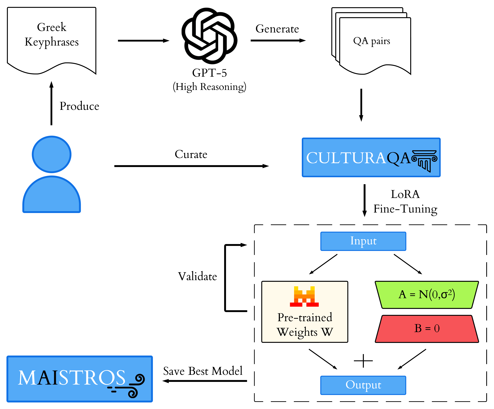

[]()
[](https://huggingface.co/IMISLab/)
[](https://github.com/cmastrokostas/DemosQA/blob/main/LICENSE)

# Maistros: A Greek Large Language Model Adapted Through Knowledge Distillation From Large Reasoning Models

## About
This repository stores the code to reproduce the [arxiv paper](https://arxiv.org/abs/2605.01870).  
The model (full and 4-bit quantized versions) and dataset are hosted on [HuggingFace](https://huggingface.co/IMISLab).

  

## Installation
```
pip install requirements.txt
```

## First Time Setup.
You need to set the project directory path in `src/config.py`.
The processed datasets and generated answers are included for reproducibility.
To reproduce the experiments, run the `reproduce_experiments.py`
Setting API keys is only required to run the `overall_approach.py` (optional).

## Citation
```
@misc{
  giarelis2026maistrosgreeklargelanguage,
  title = {Maistros: A Greek Large Language Model Adapted Through Knowledge Distillation From Large Reasoning Models}, 
  author = {Nikolaos Giarelis and Charalampos Mastrokostas and Nikos Karacapilidis},
  year = {2026},
  eprint = {2605.01870},
  archivePrefix = {arXiv},
  primaryClass = {cs.CL},
  url = {https://arxiv.org/abs/2605.01870}, 
}
```

## Contributors
* Nikolaos Giarelis (giarelis@ceid.upatras.gr)
* Charalampos Mastrokostas (cmastrokostas@ac.upatras.gr)
* Nikos Karacapilidis (karacap@upatras.gr)
